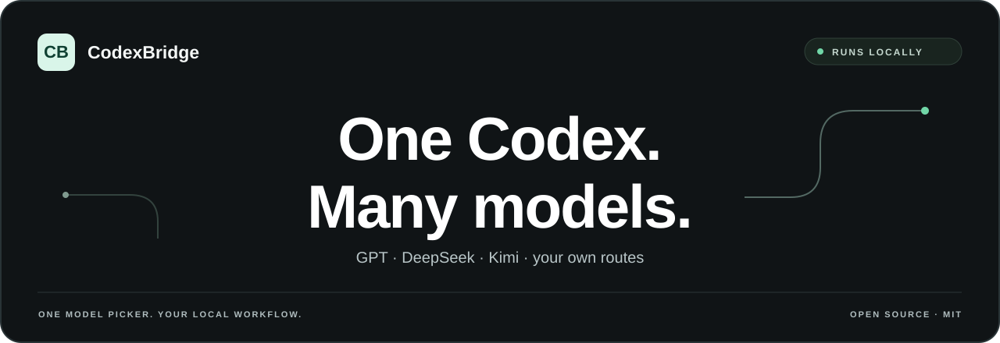

<p align="center">
  
</p>

<p align="center">
  <a href="https://github.com/wangzhezbz/codex-bridge/releases/latest"></a>
  
  
  <a href="../LICENSE"></a>
</p>

<p align="center">
  <strong>One Codex. The models you choose.</strong><br />
  A local multi-model gateway and desktop manager for Codex.<br />
  Keep one model picker, manage connections, and see your usage.
</p>

<p align="center"><a href="../README.md">简体中文</a> · <strong>English</strong></p>

<p align="center"><a href="#download">Download</a> · <a href="#what-it-does">Features</a> · <a href="#get-started">Get started</a> · <a href="#billing">Billing</a> · <a href="#documentation">Documentation</a></p>

## Download

| Windows | macOS |
| :---: | :---: |
| **[Windows installer](https://github.com/wangzhezbz/codex-bridge/releases/latest/download/CodexBridge-Windows-x64-Setup.exe)** | **[Apple Silicon](https://github.com/wangzhezbz/codex-bridge/releases/latest/download/CodexBridge-macOS-arm64-Portable.zip)** |
| [Portable fallback](https://github.com/wangzhezbz/codex-bridge/releases/latest/download/CodexBridge-Windows-x64-Portable.zip) | [Intel](https://github.com/wangzhezbz/codex-bridge/releases/latest/download/CodexBridge-macOS-x64-Portable.zip) |

Packaged builds do not require Node.js. [Release notes](releases.md) · [All releases](https://github.com/wangzhezbz/codex-bridge/releases)

## What it does

CodexBridge connects Codex to GPT, DeepSeek, Kimi and other configured providers through a local router. Codex continues to execute commands, edit files and use its local tools; the model you select handles the model request.

| You need | CodexBridge provides |
| --- | --- |
| Multiple providers in one picker | Preset and custom routes, provider settings, model ordering and search. |
| Streaming and tool calls | Responses and Chat Completions routing, protocol conversion and tool-call handling. |
| Clear usage records | Total, input, output and cache tokens, with model summaries and request details. |
| A way to diagnose failures | Readiness checks, live logs, request details and copyable task reports. |
| Codex lifecycle management | On Windows: install, update, uninstall and roll back the managed Codex application. |
| A second GPT workflow | The integrated ChatGPT-Codex-Bridge service, browser extension and MCP configuration. |

```text
ChatGPT / Codex → CodexBridge on your computer → your selected provider
```

Model requests go to the provider configured for that route. A local gateway does not make a remote model run locally.

## Get started

1. On Windows, download the Windows installer and run it. On macOS, extract the build for your chip and open `CodexBridge.app`.
2. Install Codex first. Windows users can also use CodexBridge's **Software management** page.
3. Open **Models**, configure provider credentials and select the models to show in Codex.
4. Choose **GPT subscription** or **All API** deliberately, then start Router.
5. Use **Restart ChatGPT / Codex** to reload the model picker. Select a launch target if automatic discovery cannot locate your application.

If macOS blocks first launch, see the [macOS guide](macos-portable.md). Windows installation and data paths are covered in the [installer guide](windows-setup.md) and [portable guide](windows-portable.md).

## Billing

| Mode | GPT routes | Other providers |
| --- | --- | --- |
| GPT subscription | Use the Codex login passed to the router. | Use each provider's API key. |
| All API | Use the configured API key. | Use each provider's API key. |

Switching modes is a user action. CodexBridge does not automatically change billing mode when subscription usage runs out. Provider pricing, quotas and available models still apply.

## Documentation

- [Configuration and headless operation](configuration.md)
- [Windows installer](windows-setup.md) · [Windows portable](windows-portable.md) · [macOS](macos-portable.md)
- [Release notes](releases.md)
- [Report an issue](https://github.com/wangzhezbz/codex-bridge/issues) · [Model regression matrix](model-regression-matrix.md)

For a `502`, inspect **Logs** first: whether the request reached Router, which provider it used, and the upstream status. For missing conversations, use the session recovery controls and keep your original backups. [Configuration and troubleshooting](configuration.md#troubleshooting-502--502-排查)

## Development

Use Node.js **22.16+**. See [configuration.md](configuration.md) for source setup and validation commands. API keys and user configuration stay outside version control.

Released binaries are built from their version tags. To work from the same source as the published package, check out the corresponding release tag.

## License

[MIT](../LICENSE).
